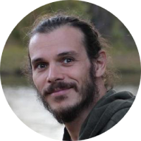

  

  <h1 class="name" align="center">Gustavo Roganti</h1>

---

### 👨‍💻 Bio

👨‍💻 I am a full stack web developer, I like solving problems and building things. I like tinkering with systems and learning new skills.
📜 Have a look at my [resume](curriculum-vitae.md).

👨‍🔬 I worked as a Full Stack Web Developer, using PHP and JavaScript. I also did a few UX designs and I worked in a development support team, analysing issues and solving bugs.

🎨 I like working in PHP using frameworks like Yii, Zend, Symfony and Wordpress
🔣 I build Wordpress sites using Gutenberg editor and custom made blocks.
🤹 I like working in JavaScript, trying to keep up with its many tools.  
🤓 I am quite nerd, I love stuff like mod-rewrite, regular expressions, SQL, and many, many more.

🗣️ I am fluent in 🇬🇧 English, 🇮🇹 Italian, 🇪🇸 Spanish, and 🇧🇷 Portuguese

### 🤝 Social

- 📧 [Email gustavo.roganti@gmail.com](mailto:gustavo.roganti@gmail.com)
- 👔 [Linkedin gustavo-roganti](https://linkedin.com/in/gustavo-roganti)
- :octocat: [GitHub gustavo-roganti](https://github.com/gustavo-roganti)

### 👔 Working Experience

👨‍💻 I worked for several web agencies in Europe, analyzing the client challenges and proposing and implementing solutions to their needs. You can have a look at my [Resume](curriculum-vitae.md).

⛴️ I am quite proud of the [Amatori.com](https://amatori.com) project, a web ticketing service. See the [ project details](projects/amatori.md).

### 🔥 Hobbies

🎲 I like boardgames, I own more than I'd like to admit, and I am part of a local association, [ludus in tabula](https://www.facebook.com/ludusintabularimini),  promoting boardgames.

📜 I love paper. I used to run a side project where I made handmade notebooks, bookbinding the pages and printing the covers with letterpress.

⛺ I like travelling, I have a small tent and I kept track of all the places I have visited in my last trip (including expenses, distances, and other data)

📷 I like photography, I have a Fuji mirrorles and a few lenses. I started with a Lomo FishEye 10 years ago. I like taking pictures of abandoned places, among other things.
